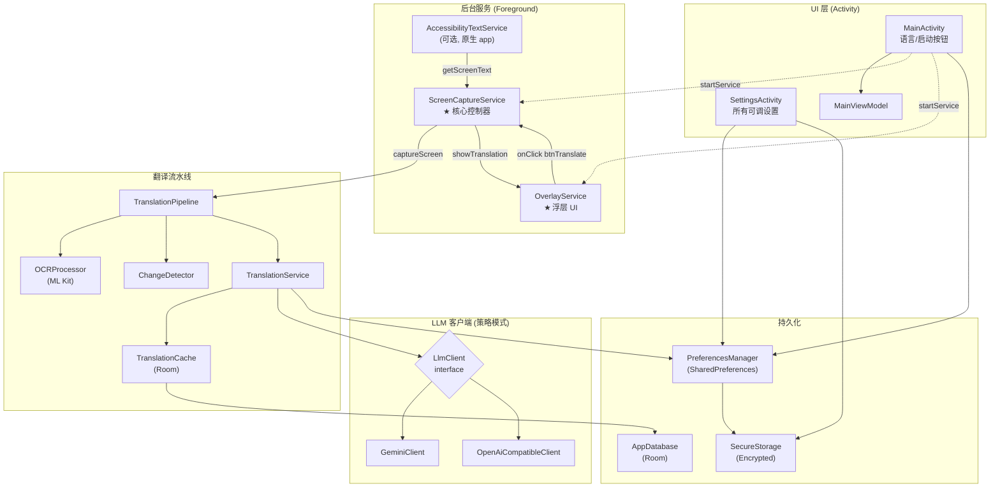
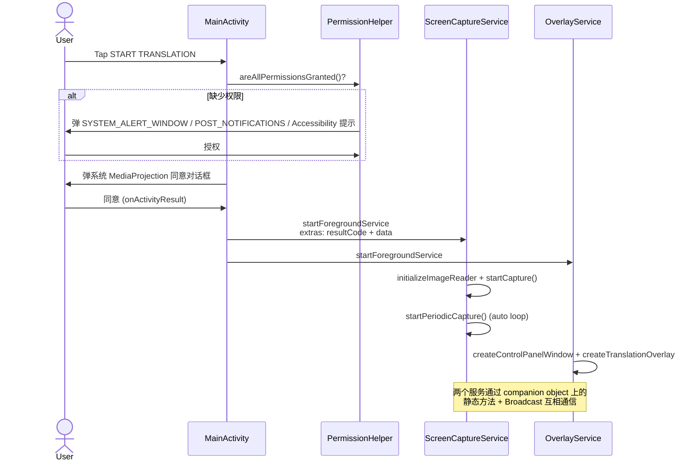
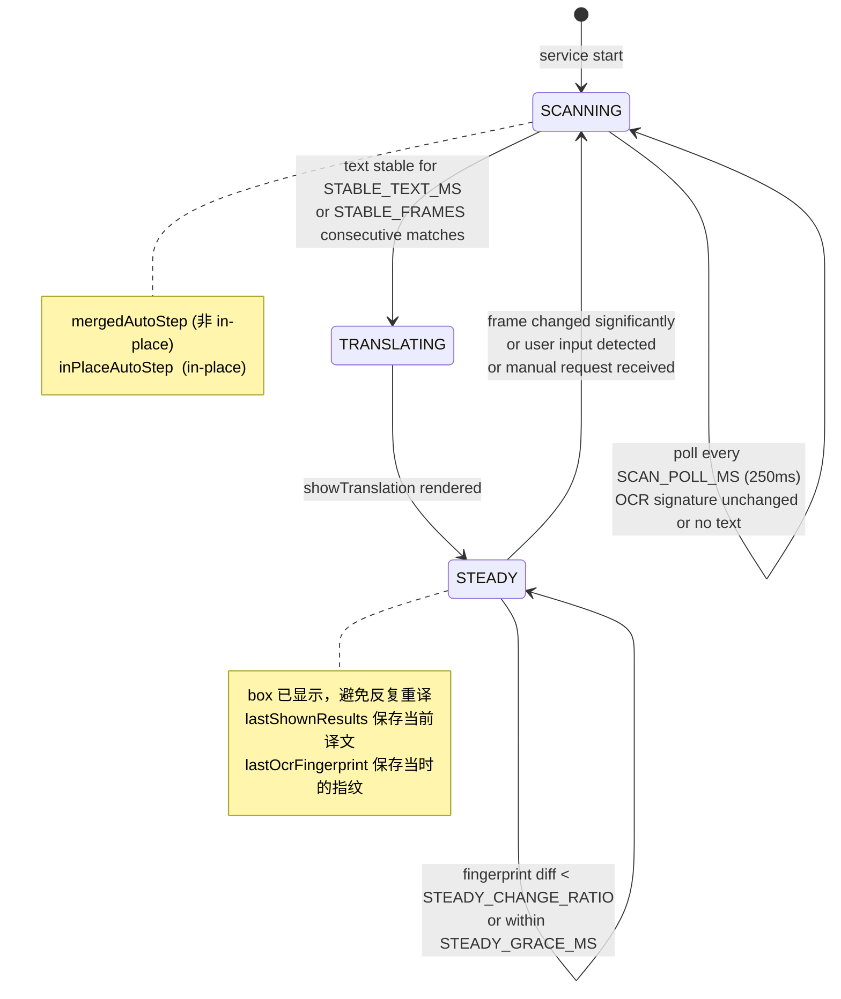
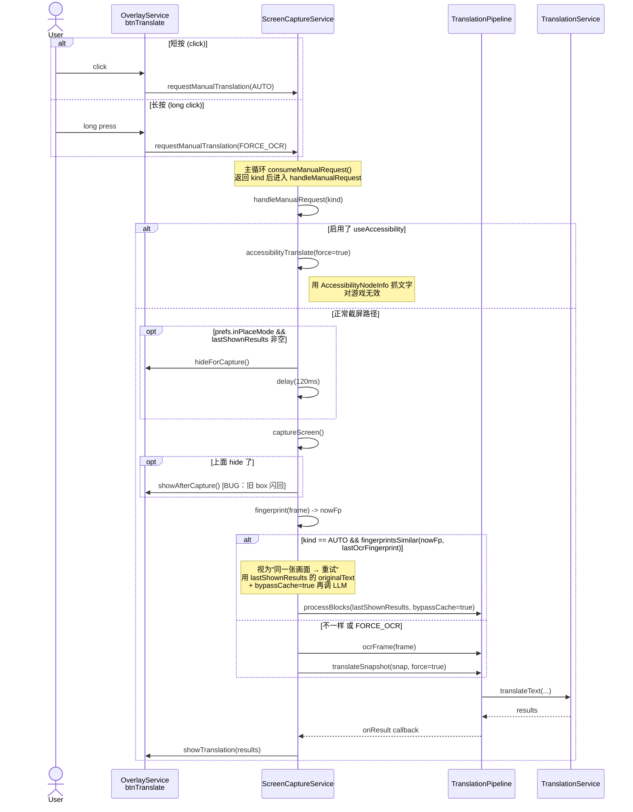
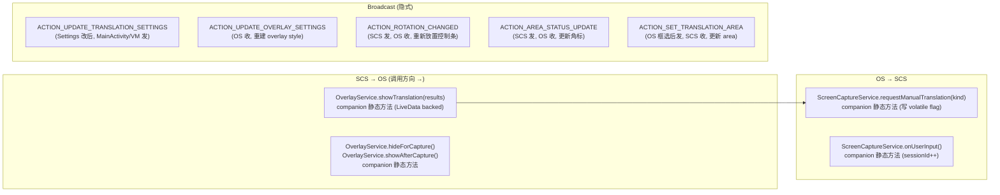
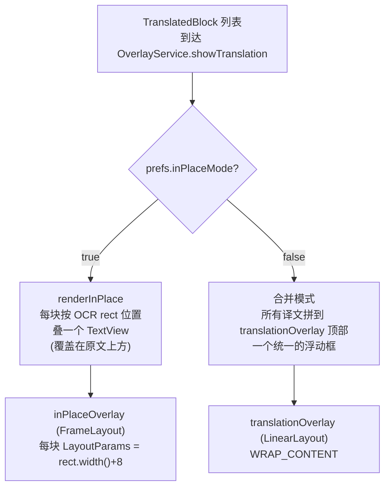
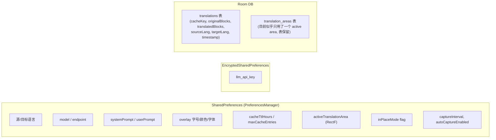

# Screen Translator — 架构与调用流程总览

文档基于 `wilson15832/ocr_translator_ai` 主分支整理，覆盖现有代码结构、模块职责、跨组件通信和典型调用链路。Mermaid 图块在 GitHub、VS Code (Markdown Preview Mermaid Support 插件)、Obsidian 均可直接渲染。

---

## 1. 模块清单

| 文件 | 行数 | 职责 |
|---|---:|---|
| `MainActivity.kt` | 356 | App 入口；语言选择；权限请求；启动/停止后台服务 |
| `MainViewModel.kt` | 50 | UI 状态 + 触发设置变更广播 |
| `SettingsActivity.kt` | 579 | 所有可调参数 UI（model、prompt、颜色、字号、缓存、区域…） |
| `PreferencesManager.kt` | 366 | `SharedPreferences` 包装层；单例；存读取所有偏好 |
| `SecureStorage.kt` | 59 | `EncryptedSharedPreferences` 封装；只用于 API key |
| `PermissionHelper.kt` | 381 | Overlay / 通知 / Accessibility / MediaProjection 权限编排 |
| **`ScreenCaptureService.kt`** | **1275** | **核心控制器**：截屏、调度、状态机（scanning/steady）、手动/自动请求分发 |
| **`OverlayService.kt`** | **1544** | 浮动控制条 + 翻译结果浮层（merged / in-place 两种渲染）+ 区域选择 |
| `TranslationPipeline.kt` | 258 | 把"截屏 → OCR → 翻译 → 结果"拼起来；处理 bitmap 回收 |
| `TranslationService.kt` | 254 | 构造 LLM 请求、缓存、解析响应 |
| `OCRProcessor.kt` | 100 | ML Kit TextRecognizer 包装（中/日/韩/拉丁/天城文） |
| `AccessibilityTextService.kt` | 91 | 用 AccessibilityNodeInfo 直接抓文字（对游戏无效，仅原生 App） |
| `ChangeDetector.kt` | 52 | Levenshtein 文本相似度，决定"画面是否变化" |
| `TranslationCache.kt` | 81 | Room DB 翻译缓存（SHA-256 key） |
| `AppDatabase.kt` + `TranslationArea*.kt` | ~210 | Room 实体 + DAO（缓存表 + 区域表） |
| `LlmClient.kt` | 5 | 接口：`translate(systemPrompt, userPrompt) -> String` |
| `GeminiClient.kt` | 58 | Gemini REST 实现 |
| `OpenAiCompatibleClient.kt` | 59 | OpenAI / DeepSeek 等兼容端点实现 |
| `GestureControlPanel.kt` | 100 | 自定义 ViewGroup，支持长按拖动整个控制条 |
| `AreaSelectionOverlay.kt` | 83 | 框选 OCR 区域用的全屏 View |

---

## 2. 高层组件关系



---

## 3. 启动与权限流程



---

## 4. ScreenCaptureService 状态机

`ScreenCaptureService` 是一个**双状态**主循环：



### 关键调谐常数（`ScreenCaptureService.kt` 顶部）

```kotlin
STABLE_FRAMES       = 2       // 合并模式：连续稳定帧数
STABLE_TEXT_MS      = 400     // in-place：OCR 文本必须保持此时长
STEADY_CHANGE_RATIO = 0.30    // 进入 steady 后，认为画面真变了的指纹差异阈值
STEADY_GRACE_MS     = 1000    // 显示框后这段时间内不做帧差判断
SCAN_POLL_MS        = 250     // 主循环 tick
POST_TAP_WAIT_MS    = 4000    // 用户点了屏幕后等多久才重新进入 scanning
```

---

## 5. 自动模式：一次翻译循环（in-place）

```mermaid
sequenceDiagram
    participant Loop as startPeriodicCapture<br/>(coroutine, while(running))
    participant SCS as ScreenCaptureService
    participant TP as TranslationPipeline
    participant OCR as OCRProcessor
    participant CD as ChangeDetector
    participant TS as TranslationService
    participant TC as TranslationCache
    participant LLM as LlmClient
    participant OS as OverlayService

    loop every SCAN_POLL_MS
        Loop->>SCS: inPlaceAutoStep()
        SCS->>SCS: captureScreen() -> Bitmap
        SCS->>TP: ocrSignature(frame, area)
        TP->>OCR: recognize(cropped)
        OCR-->>TP: List<TextBlock>
        TP-->>SCS: signature string
        alt signature unchanged
            SCS-->>Loop: continue (stay in steady)
        else signature changed and stable >= STABLE_TEXT_MS
            SCS->>SCS: handleStableScan()
            SCS->>TP: ocrFrame(frame) -> OcrSnapshot
            SCS->>TP: translateSnapshot(snap, src, tgt, force=false)
            TP->>CD: hasChanged(blocks)?
            alt 文本几乎没变
                CD-->>TP: false → 跳过 LLM
            else 真的变了
                TP->>TS: translateText(blocks, src, tgt)
                TS->>TC: getTranslation(cacheKey)
                alt cache hit
                    TC-->>TS: List<TranslatedBlock>
                else cache miss
                    TS->>LLM: translate(systemPrompt, userPrompt)
                    LLM-->>TS: raw response string
                    TS->>TS: parseTranslationResult()
                    TS->>TC: saveTranslation()
                end
                TS-->>TP: List<TranslatedBlock>
            end
            TP->>TP: sampleBackgroundColor 每块取背景色
            TP-->>SCS: onResult(finalResults) callback
            SCS->>OS: showTranslation(results)
            SCS->>SCS: enterSteady()
        end
    end
```

---

## 6. 手动模式（短按 / 长按 manual icon）



> **已知 bug**（你已确认）:
> 1. 指纹判同分辨率太低（32×18 cell, 60 RGB 阈, 10% cell），新对话框常被误判为旧 → 短按不更新译文，必须长按。
> 2. `hideForCapture()/showAfterCapture()` 这一对在手动路径上会让旧 box 短暂闪回。
> 3. in-place 模式宽对话框排版易乱（box 宽度 = OCR rect + 8）。

---

## 7. 跨组件通信清单

服务之间不是直接持有对方引用，而是混用了**三种机制**——这是整个项目最容易出 bug 的地方。



### 7.1 ScreenCaptureService companion-level 静态状态

```kotlin
@Volatile var sessionId: Int = 0           // 每次"屏幕变了/用户输入"++，丢弃过期翻译结果
@Volatile private var manualRequest: ManualKind? = null
@Volatile private var userInputPending: Boolean = false
```

`sessionId` 是为了：翻译异步进行时，如果中途屏幕变了，等结果回来时 `sessionId` 已经变了，回调里发现就丢弃这个结果，避免显示过期译文。

### 7.2 ScreenCaptureService instance 状态

```kotlin
private var lastShownResults: List<TranslatedBlock>  // 当前显示的译文
@Volatile private var lastOcrFingerprint: IntArray?  // 上次成功翻译时的画面指纹（被 box 遮之前）
@Volatile private var pendingOcrFingerprint: IntArray?  // 翻译进行中的指纹，成功后提升为 last
```

---

## 8. 外部 API

### 8.1 LLM 接口（统一抽象）

```kotlin
interface LlmClient {
    suspend fun translate(systemPrompt: String, userPrompt: String): String
}
```

`TranslationService.createLlmClient()` 根据 `model` 字段路由：

| 条件 | 实现 | 端点 |
|---|---|---|
| `model.startsWith("gpt-") \|\| "deepseek-"` 等 | `OpenAiCompatibleClient` | 用户配置 (`llmApiEndpoint`) |
| 其他（默认 gemini-*） | `GeminiClient` | `https://generativelanguage.googleapis.com/v1beta/models/{model}:generateContent` |

请求超时（`TranslationService.kt`）：
- `connectTimeout = 10s`
- `readTimeout = 30s`
- `callTimeout = 40s` ← 整体上限

### 8.2 ML Kit OCR

`OCRProcessor` 持有一个 `TextRecognizer`，按当前 `sourceLanguage` 选择对应 recognizer：

| 语言 code | Recognizer |
|---|---|
| `zh` | `ChineseTextRecognizerOptions` |
| `ja` | `JapaneseTextRecognizerOptions` |
| `ko` | `KoreanTextRecognizerOptions` |
| `hi` | `DevanagariTextRecognizerOptions` |
| 其他 | `TextRecognizerOptions.DEFAULT_OPTIONS` (拉丁) |

`Mutex` 保护 recognize/setLanguage/cleanup，避免并发关闭崩溃。

### 8.3 MediaProjection 截屏

```
MediaProjectionManager.getMediaProjection(resultCode, data)
  -> createVirtualDisplay(... ImageReader.surface ...)
  -> ImageReader.acquireLatestImage()
  -> Image.planes[0].buffer -> Bitmap
```

旋转处理在 `updateCaptureWithRotation()` —— 旋转时重建 VirtualDisplay。

---

## 9. Prompt 与缓存

### 9.1 Prompt 模板（默认值在 `PreferencesManager`）

```
[system]
You are a professional translator. Translate naturally and accurately,
preserving tone and formatting.

[user]
Translate the following text from {source} to {target}.
Maintain the original formatting and layout as much as possible.
Keep the BLOCK_XXX: prefixes in the output but don't translate them.

Text to translate:
BLOCK_<hashCode>: <ocr text 1>

BLOCK_<hashCode>: <ocr text 2>

Translation:
```

`{source}`、`{target}` 在 `createTranslationPrompt` 里替换。`BLOCK_${boundingBox.hashCode()}:` 用 Int hashCode 作为 ID，输出的对应行被 `parseTranslationResult` 按 `BLOCK_xxx:` 切回去。

### 9.2 缓存键

```kotlin
seed = "<text1|text2|…>|<sourceLanguage>|<targetLanguage>|<modelName>"
cacheKey = SHA-256(seed)
```

切换模型/语言会自然 miss，符合预期。命中后**直接返回缓存的 `TranslatedBlock` 列表**，不走 LLM。

`bypassCache=true` 路径（用于"手动重试"）：
1. 仍按 cacheKey 算
2. **跳过查询**直接调 LLM
3. 新结果**覆盖**旧缓存

---

## 10. UI 渲染：两种模式



两个 overlay 都是 `WindowManager.addView()` 加到系统 window 层（`TYPE_APPLICATION_OVERLAY` on API 26+，`TYPE_PHONE` 之前）。控制条 `controlPanelWindow` 是第三个独立 window。

---

## 11. 数据持久化



---

## 12. 当前已识别的优化点（汇总你之前讨论的）

| # | 项 | 当前 | 目标 |
|---|---|---|---|
| 1 | 手动 AUTO 短按指纹误判 | 32×18 像素指纹 | 改成 OCR 文本对比 |
| 2 | 手动按下旧 box 闪回 | hide → restore 旧 visibility | clearShownTranslation()，由新渲染恢复 |
| 3 | in-place box 宽度截断长译文 | rect.width() + 8 | 1.5× 自适应（窄 1.5/宽 1.1）+ 右沿钳制 |
| 4 | LLM 延迟 1-25s | 阻塞等完整 response | **流式渲染 + 模型换 flash 档** |
| 5 | OCR 引擎单一 | ML Kit only | 抽象 `OcrEngine`，加 PaddleOCR / LLM Vision（独立 PR） |
| 6 | UI 主题色硬编码 | `@color/primary` | 多 theme 变体 + 圆圈选择器 |
| 7 | App 图标固定 | 单 icon | activity-alias + 预置图标 |
| 8 | Prompt 冗余 | `BLOCK_<hashCode>` + 三行说明 | 短前缀 `B1`，单块时跳过协议 |
| 9 | `max_tokens = 2048` | 偏大 | 400-512 |
| 10 | 无连接预热 | 首次请求 TLS 慢 | 服务启动时 HEAD 预热 |

---

## 13. 阅读路径建议

第一次走代码顺序建议：

1. `MainActivity.onCreate` → `requestScreenCapture` → `startTranslationService`
2. `ScreenCaptureService.onCreate` → `onStartCommand` → `startCapture` → `startPeriodicCapture`
3. 主循环里的 `inPlaceAutoStep` 或 `mergedAutoStep`
4. `handleStableScan` → `TranslationPipeline.ocrFrame` → `translateSnapshot`
5. `TranslationService.translateText` → `LlmClient.translate`
6. 回调 `onResult` → `OverlayService.showTranslation` → `renderInPlace`

手动路径独立看 `handleManualRequest` 即可，会调到第 4-6 步同样的下游。

设置变更路径：`SettingsActivity` 改 prefs → 发 broadcast → `ScreenCaptureService`/`OverlayService` 收到后 reload prefs。

---

*生成日期：2026-06-09*
*基于 commit: main HEAD*
