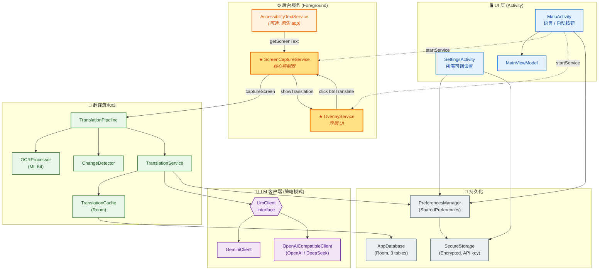
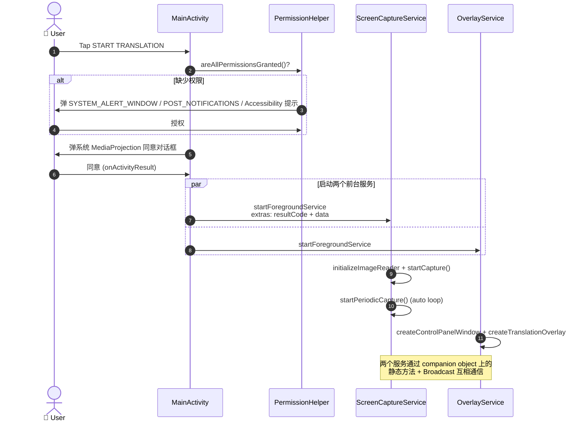
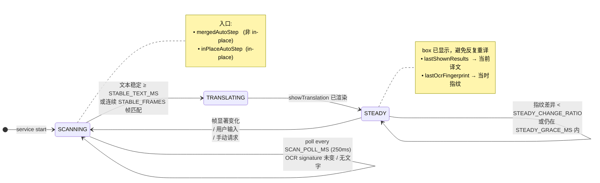
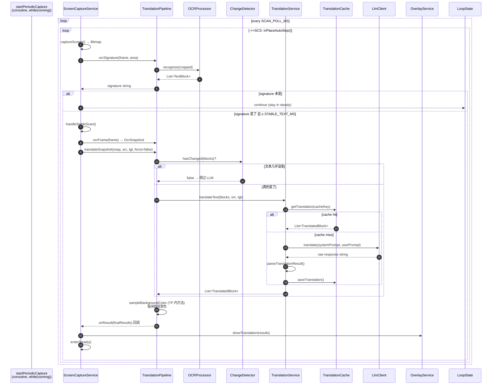
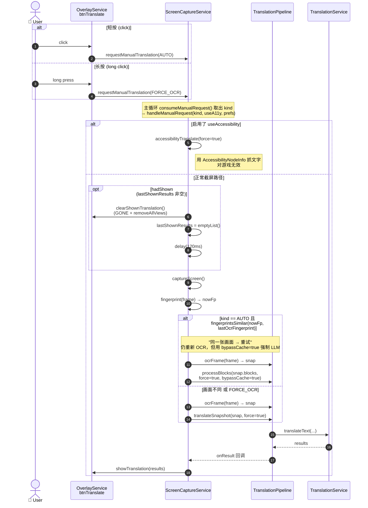
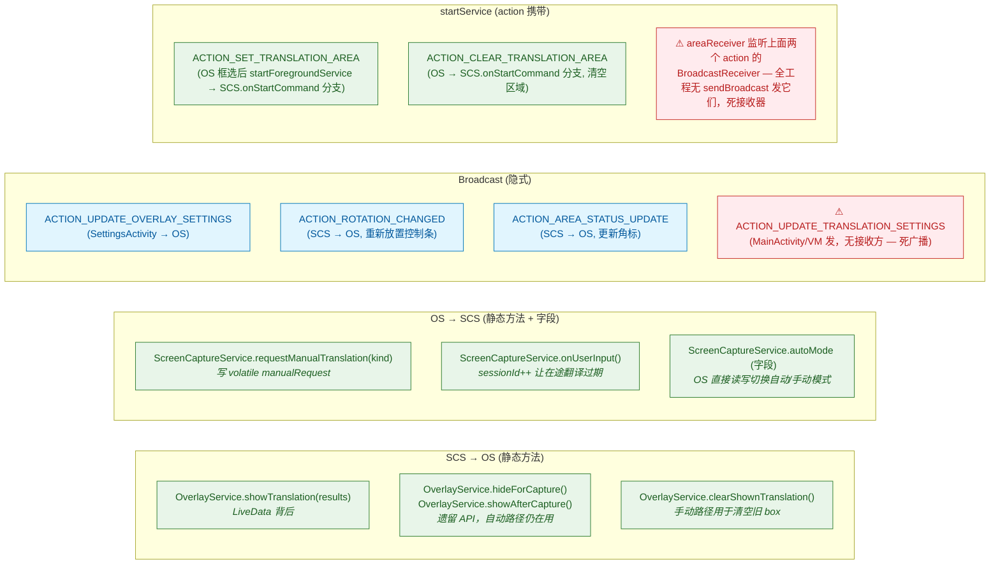
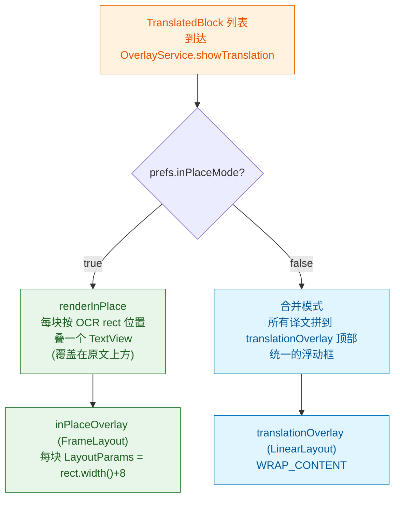
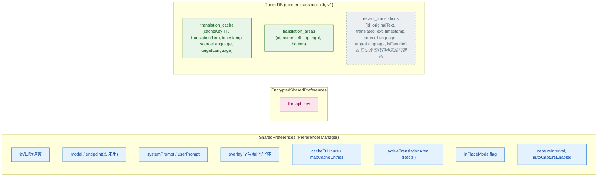

# Screen Translator — 架构与调用流程总览

文档基于 `wilson15832/ocr_translator_ai` 主分支（commit `13ad0c1`）整理，覆盖现有代码结构、模块职责、跨组件通信和典型调用链路。Mermaid 图块在 GitHub、VS Code (Markdown Preview Mermaid Support 插件)、Obsidian 均可直接渲染。

> 本次修订（2026-06-09）相对上一版的主要更正：
> - §8.1 LLM 路由：endpoint 实际硬编码在 `TranslationService` 内，与偏好里的 `llmApiEndpoint` 无关
> - §11 Room：实际有 **3 张表**（含一张未使用的 `recent_translations`），且 `translation_cache` 译文是单列 JSON
> - §6 手动模式：旧的 `hideForCapture/showAfterCapture` 已被 `clearShownTranslation()` 取代
> - §7 通信清单：补 `ACTION_CLEAR_TRANSLATION_AREA`、补 `clearShownTranslation()`、补 `autoMode` 静态状态，并标出 `ACTION_UPDATE_TRANSLATION_SETTINGS` 是无接收方的死广播
> - §9.1 Prompt：占位符其实是 `{source}` / `{target}` / `{text}` 三个

---

## 1. 模块清单

| 文件 | 行数 | 职责 |
|---|---:|---|
| `MainActivity.kt` | 302 | App 入口；语言选择；权限请求；启动/停止后台服务 |
| `MainViewModel.kt` | 41 | UI 状态；发广播 `ACTION_UPDATE_TRANSLATION_SETTINGS`（⚠ 当前无接收方，见 §7） |
| `SettingsActivity.kt` | 492 | 所有可调参数 UI（model、prompt、颜色、字号、缓存、区域…） |
| `PreferencesManager.kt` | 307 | `SharedPreferences` 包装层；单例；存读取所有偏好 |
| `SecureStorage.kt` | 52 | `EncryptedSharedPreferences` 封装；只用于 API key |
| `PermissionHelper.kt` | 338 | Overlay / 通知 / Accessibility / MediaProjection 权限编排 |
| **`ScreenCaptureService.kt`** | **1144** | **核心控制器**：截屏、调度、状态机（scanning/steady）、手动/自动请求分发 |
| **`OverlayService.kt`** | **1391** | 浮动控制条 + 翻译结果浮层（merged / in-place 两种渲染）+ 区域选择 |
| `TranslationPipeline.kt` | 244 | 把"截屏 → OCR → 翻译 → 结果"拼起来；处理 bitmap 回收 |
| `TranslationService.kt` | 219 | 构造 LLM 请求、缓存、解析响应 |
| `OCRProcessor.kt` | 88 | ML Kit TextRecognizer 包装（**Kotlin `object` 单例**，中/日/韩/拉丁/天城文） |
| `AccessibilityTextService.kt` | 78 | 用 AccessibilityNodeInfo 直接抓文字（对游戏无效，仅原生 App） |
| `ChangeDetector.kt` | 46 | Levenshtein 文本相似度，决定"画面是否变化" |
| `TranslationCache.kt` | 71 | Room DB 翻译缓存（SHA-256 key） |
| `AppDatabase.kt` | 147 | Room 数据库；含 3 个 entity + 3 个 DAO（见 §11） |
| `TranslationArea.kt` + `TranslationAreaDao.kt` | 27 + 16 | Room 实体 + DAO（区域表） |
| `LlmClient.kt` | 6 | 接口：`translate(systemPrompt, userPrompt) -> String` |
| `GeminiClient.kt` | 52 | Gemini REST 实现 |
| `OpenAiCompatibleClient.kt` | 53 | OpenAI / DeepSeek 等兼容端点实现 |
| `GestureControlPanel.kt` | 92 | 自定义 ViewGroup，支持长按拖动整个控制条 |
| `AreaSelectionOverlay.kt` | 76 | 框选 OCR 区域用的全屏 View |

---

## 2. 高层组件关系



---

## 3. 启动与权限流程



---

## 4. ScreenCaptureService 状态机

`ScreenCaptureService` 是一个**双状态**主循环：



### 关键调谐常数（`ScreenCaptureService.kt` 顶部 companion）

```kotlin
STABLE_FRAMES       = 2       // 合并模式：连续稳定帧数
STABLE_TEXT_MS      = 400     // in-place：OCR 文本必须保持此时长
STEADY_CHANGE_RATIO = 0.30    // 进入 steady 后，认为画面真变了的指纹差异阈值
STEADY_GRACE_MS     = 1000    // 显示框后这段时间内不做帧差判断
SCAN_POLL_MS        = 250     // 主循环 tick（scanning 状态下的高频轮询）
POST_TAP_WAIT_MS    = 4000    // 用户点了屏幕后等多久才允许从缓存恢复译文
```

---

## 5. 自动模式：一次翻译循环（in-place）



---

## 6. 手动模式（短按 / 长按 manual icon）

> ⚠️ 本节相对旧版已更新：实际代码已经用 `clearShownTranslation()` 取代了原来的 `hideForCapture/showAfterCapture` 闪回路径；"重试同一画面"也是用**新 OCR 出的 blocks**走 LLM，不是直接复用 `lastShownResults.originalText`。



> **已知 / 待解决 bug**：
> 1. 指纹判同分辨率太低（32×18 cell, 60 RGB 阈, 10% cell），新对话框常被误判为旧 → 短按不更新译文，必须长按。**根治需要改成 OCR 文本对比，而不是像素指纹**（见 §12 #1）。
> 2. ~~`hideForCapture()/showAfterCapture()` 闪回旧 box~~ **已修复**：手动路径改用 `clearShownTranslation()` + `delay(120)`，新结果到来时由 `showTranslation` 重新渲染。
> 3. in-place 模式宽对话框排版易乱（box 宽度 = OCR rect + 8），见 §12 #3。

---

## 7. 跨组件通信清单

服务之间不是直接持有对方引用，而是混用了**三种机制**——这是整个项目最容易出 bug 的地方。



### 7.1 ScreenCaptureService companion-level 静态状态

```kotlin
@Volatile var sessionId: Int = 0           // 每次"屏幕变了/用户输入"++，丢弃过期翻译结果
@Volatile var autoMode: Boolean = false    // OS 控制条直接翻转此字段切换模式
@Volatile private var manualRequest: ManualKind? = null
@Volatile private var userInputPending: Boolean = false
```

`sessionId` 是为了：翻译异步进行时，如果中途屏幕变了，等结果回来时 `sessionId` 已经变了，回调里发现就丢弃这个结果，避免显示过期译文。

### 7.2 ScreenCaptureService instance 状态

```kotlin
private var lastShownResults: List<TranslatedBlock>  // 当前显示的译文
@Volatile private var lastOcrFingerprint: IntArray?  // 上次成功翻译时的画面指纹
@Volatile private var pendingOcrFingerprint: IntArray?  // 翻译进行中的指纹，成功后提升为 last
```

### 7.3 关于 `ACTION_UPDATE_TRANSLATION_SETTINGS`

`MainActivity` 和 `MainViewModel` 在改完源/目标语言时都会 `sendBroadcast` 这条 action，但**全工程没有任何 `BroadcastReceiver` 注册它**。意思是：

- UI 改语言确实把值写进了 `PreferencesManager`
- 服务下一次进入主循环 reload prefs 时会读到新值（事实上是这条路径生效）
- 这条广播本身**没有任何效果**——属于历史残留，要么实现接收端，要么直接删掉避免误导。

---

## 8. 外部 API

### 8.1 LLM 接口（统一抽象）

```kotlin
interface LlmClient {
    suspend fun translate(systemPrompt: String, userPrompt: String): String
}
```

`TranslationService.createLlmClient()` 根据 `modelName` 字段路由（注意**endpoint 全部硬编码**在该方法内，与偏好里的 `llmApiEndpoint` 字段无关——后者目前在 Settings UI 仍可见但运行时未读取，见 `PreferencesManager.kt:120-127` 的注释）：

| 条件 (`model.startsWith(...)`) | 实现 | Endpoint（硬编码） |
|---|---|---|
| `"deepseek"` | `OpenAiCompatibleClient` | `https://api.deepseek.com/chat/completions` |
| `"gpt"` | `OpenAiCompatibleClient` | `https://api.openai.com/v1/chat/completions` |
| 其他（默认 `gemini-*`） | `GeminiClient` | `https://generativelanguage.googleapis.com/v1beta/models/{model}:generateContent` |

请求超时（`TranslationService.kt:47-53`）：
- `connectTimeout = 10s`
- `readTimeout = 30s`
- `writeTimeout = 15s`
- `callTimeout = 40s` ← 整体上限

### 8.2 ML Kit OCR

`OCRProcessor` 是 **Kotlin `object`（顶层单例）**，全应用共享同一个 recognizer。`Mutex` 保护 recognize / setLanguage / cleanup，避免并发关闭崩溃。

| 语言 code | Recognizer |
|---|---|
| `zh` | `ChineseTextRecognizerOptions` |
| `ja` | `JapaneseTextRecognizerOptions` (默认值) |
| `ko` | `KoreanTextRecognizerOptions` |
| `hi` | `DevanagariTextRecognizerOptions` |
| 其他 | `TextRecognizerOptions.DEFAULT_OPTIONS` (拉丁) |

注意事项：
- `TextBlock.confidence` 字段恒为 `1f`（ML Kit 不暴露 per-block 置信度，accessibility 路径也照搬 1f）。读者**不要**把它当真实置信度用。
- `setScreenRotation()` 会更新 `currentRotation`，但 `recognize()` 实际用 `InputImage.fromBitmap(bitmap, 0)`——rotation 字段当前保留未用（因为 MediaProjection 镜像已经是正向的）。

### 8.3 MediaProjection 截屏

```
MediaProjectionManager.getMediaProjection(resultCode, data)
  → createVirtualDisplay(... ImageReader.surface ...)
  → ImageReader.acquireLatestImage()
  → Image.planes[0].buffer → Bitmap
```

旋转处理在 `updateCaptureWithRotation()` —— 旋转时重建 VirtualDisplay。

---

## 9. Prompt 与缓存

### 9.1 Prompt 模板（默认值在 `PreferencesManager`）

```
[system]
You are a professional translator. Translate naturally and accurately,
preserving tone and formatting.

[user]
Translate the following text from {source} to {target}.
Maintain the original formatting and layout as much as possible.
Keep the BLOCK_XXX: prefixes in the output but don't translate them.

Text to translate:
{text}

Translation:
```

`createTranslationPrompt` 会替换 **三个**占位符：

| 占位符 | 替换为 |
|---|---|
| `{source}` | 源语言代码 |
| `{target}` | 目标语言代码 |
| `{text}` | 由各 block 拼接成的 `BLOCK_<hashCode>: <ocr text>` 多行字符串 |

`BLOCK_${boundingBox.hashCode()}:` 用 `android.graphics.Rect` 的 hashCode 作为 ID；LLM 返回后 `parseTranslationResult` 按 `BLOCK_xxx:` 切回去并按 hashCode 找回 originalBlock。

⚠️ 自定义 prompt 时**必须保留 `{text}` 占位符**，否则 OCR 内容根本不会被拼进去。

### 9.2 缓存键

```kotlin
seed = "<text1|text2|…>|<sourceLanguage>|<targetLanguage>|<modelName>"
cacheKey = SHA-256(seed)  // 输出十六进制小写串
```

切换模型 / 语言会自然 miss，符合预期。命中后**直接返回缓存的 `TranslatedBlock` 列表**，不走 LLM。

`bypassCache=true` 路径（用于"手动重试"）：

1. 仍按 cacheKey 算
2. **跳过查询**直接调 LLM
3. 新结果**覆盖** (`OnConflictStrategy.REPLACE`) 旧缓存

---

## 10. UI 渲染：两种模式



两个 overlay 都是 `WindowManager.addView()` 加到系统 window 层（`TYPE_APPLICATION_OVERLAY` on API 26+，`TYPE_PHONE` 之前）。控制条 `controlPanelWindow` 是第三个独立 window。

---

## 11. 数据持久化



### 11.1 几点说明

- **`translation_cache` 实际只有 5 列**——译文是整段 JSON 字符串塞在 `translationJson` 里，由 `TranslationCache` 序列化/反序列化。
- **`recent_translations` 是预留**——entity、DAO、表都建了，但全工程 `grep` 不到任何调用方。属于历史/收藏功能的占位脚手架。
- **`translation_areas`** 目前业务上只用一个 active area（存在 `PreferencesManager` 里的 `RectF`），表保留供未来扩展多区域。

---

## 12. 当前已识别的优化点

> **清理进度（截至 2026-06，step 1 已完成）**：#11/#13–#21/#24–#28/#30–#35/#37/#38/#40/#41/#42 全部完成，含 2 个真 bug（#28 snap 泄漏、#32 observer 崩溃）。整体净删 ~600 行死代码。
> **已实测通过**：#28（框选+狂按，内存平稳）、#32（停止→重开不残留）、#34（转屏 in-place 框贴原文）、#37（长按同画面得不同译文）。
> **待实测**：#29（后台强杀进程，确认不出无授权僵尸）。
> **剩余 step 2（见 §12.2）**：#12 决策、#15 OCRProcessor cleanup 可重建版、#22 clearCache 接 UI、#23 区域通信改静态。（#36+#39 已处理：删除"高亮原文"功能）
> **新发现并已修**：#42（MainActivity 目标语言 spinner 缺 onItemSelectedListener，目标语言改了不保存——已加 listener + `updateTargetLanguage`）。
> **顺带架构调整**：语言设置统一到 MainActivity（设置页 SettingsActivity 的语言 spinner + 布局已移除）；FORCE_OCR 改为长按真正 bypassCache 重译。

| # | 项 | 当前 | 目标 | 状态 |
|---|---|---|---|---|
| 1 | 手动 AUTO 短按指纹误判 | 32×18 像素指纹 | 改成 OCR 文本对比 | 待办 |
| 2 | ~~手动按下旧 box 闪回~~ | ~~hide → restore 旧 visibility~~ | `clearShownTranslation()`，由新渲染恢复 | ✅ **已完成** |
| 3 | in-place box 宽度截断长译文 | rect.width() + 8 | 1.5× 自适应（窄 1.5 / 宽 1.1）+ 右沿钳制 | 待办 |
| 4 | LLM 延迟 1-25s | 阻塞等完整 response | 流式渲染 + 模型换 flash 档 | 待办 |
| 5 | OCR 引擎单一 | ML Kit only | 抽象 `OcrEngine`，加 PaddleOCR / LLM Vision | 待办 |
| 6 | UI 主题色硬编码 | `@color/primary` | 多 theme 变体 + 圆圈选择器 | 待办 |
| 7 | App 图标固定 | 单 icon | activity-alias + 预置图标 | 待办 |
| 8 | Prompt 冗余 | `BLOCK_<hashCode>` + 三行说明 | 短前缀 `B1`，单块时跳过协议 | 待办 |
| 9 | `max_tokens = 2048` | 偏大 | 400-512 | 待办 |
| 10 | 无连接预热 | 首次请求 TLS 慢 | 服务启动时 HEAD 预热 | 待办 |
| 11 | `ACTION_UPDATE_TRANSLATION_SETTINGS` 是死广播 | 发但无人收 | 删除发送端，或加 SCS 接收端实现热切换 | 新增 |
| 12 | `llmApiEndpoint` 偏好与运行时脱节 | UI 可改但不生效 | 决定是恢复读取还是从 Settings UI 移除 | 新增 |
| 13 | `recent_translations` 表与 DAO 闲置 | dead code | 接入历史/收藏界面，或移除 entity | 新增 |
| 14 | `OCRProcessor.setScreenRotation`/`currentRotation` 死字段 | `ScreenCaptureService:350` 写入但 `recognize()` 写死 `0`，无人读 | 删除该方法与字段（MediaProjection 镜像已正向，不需旋转提示） | 新增 |
| 15 | `OCRProcessor.cleanup()` 从不调用 | recognizer 持 native 资源，直到进程被杀才释放 | 在 `ScreenCaptureService.onDestroy()` 用协程调 `cleanup()` 释放 | 新增 |
| 16 | `AppDatabase.Converters` 全部闲置 | 无 entity 用 `Rect`/`Map` 字段（`TranslationArea` 手动拆 4 个 `Float`），4 个 `@TypeConverter` 及 `@TypeConverters` 注册均无 Room 触发 | 删除 `Converters` 类与注解（删前确认无 entity 使用 Rect/Map 类型字段） | 新增 |
| 17 | `TranslationCacheDao.getRecentTranslations` 无调用 | 缓存表 DAO（`AppDatabase.kt:128`）按时间倒序取最近 N 条，全工程无调用方（与 §11 dead 的 `recent_translations` 表 DAO 同名但不同表） | 删除该 DAO 方法，或接入"最近翻译"展示 | 新增 |
| 18 | `translation_areas` 表 / `TranslationArea` / `TranslationAreaDao` 整套 dead | DAO 全部方法零调用；活动框选区域实际存在 `PreferencesManager`（`saveActiveTranslationArea`/`getActiveTranslationArea` 的 `RectF`），运行时用内存 `activeTranslationArea` 裁剪。该表为"多区域命名管理"预留但未接入 | 实现多区域 UI 接入该表，或移除整套 entity/DAO/表登记 | 新增 |
| 19 | `PreferencesManager.saveSourceLanguage`/`saveTargetLanguage` 冗余 | 函数体仅 `sourceLanguage = language`，等于给属性 setter 再套一层（`PreferencesManager.kt:358-365`） | 删除两个包装方法，调用方直接赋值属性 | 新增 |
| 20 | `saveTargetLanguage` 日志文案 copy-paste bug | `PreferencesManager.kt:364` 打印 "Saving source language"，应为 target | 改日志文案（无害，随 #19 一并清理） | 新增 |
| 21 | `migrateLegacyApiKey` 明文 key 迁移逻辑可删 | 应对"旧版明文 key→加密存储"升级，但**项目尚未发布**，无旧版用户，迁移永不触发 | 删除该方法、`KEY_LLM_API_KEY`（明文槽常量）及 `init` 调用 | 新增 |
| 22 | `TranslationCache.clearCache()` 无调用 | `TranslationCache.kt:77` 清空缓存方法零调用，连带 `TranslationCacheDao.deleteAll()`（唯一调用点在此）成悬空链路 | 接入 Settings 的"清除缓存"按钮，或移除 `clearCache`/`deleteAll` | 新增 |
| 23 | 区域通信用 startService(action) 传，与其他 SCS↔OS 通信不一致 | 框选区域实际走 `OverlayService.startForegroundService(action=ACTION_SET/CLEAR_TRANSLATION_AREA, extra=坐标)` → `SCS.onStartCommand` 分支（**非广播**）；而 `autoMode`/`manualRequest` 走 companion 静态字段/方法。点对点场景用 startService 绕、要打包 extras | 改为静态方法（如 `setTranslationArea(rect)`，仿 `requestManualTranslation`），统一通信方式（呼应 §7 "混用三种机制"） | 新增 |
| 24 | `areaReceiver` 是死接收器 | `ScreenCaptureService.kt:190` 注册 `BroadcastReceiver` 监听 `ACTION_SET/CLEAR_TRANSLATION_AREA`，但全工程无 `sendBroadcast` 发这两个 action（区域实际走 onStartCommand，见 #23）。注册 + onReceive + IntentFilter 全部白搭 | 删除 `areaReceiver`、其 `IntentFilter` 与 `registerReceiver` 调用 | 新增 |
| 25 | `AreaManagementFragment` 注释残留 | `ScreenCaptureService.kt:517,548` 注释称区域 Intent "由 AreaManagementFragment 发送"，但该类全工程不存在（已移除），实际由 `OverlayService` 发 | 更正注释为 OverlayService | 新增 |
| 26 | `captureScreen` bitmap 降级方案产出错图 | `ScreenCaptureService.kt:1083-1094` 正常建图失败后，用 `√(bufferSize/4)` 估宽、除法定高反推"安全尺寸"重建 bitmap。假设正方形 → 尺寸与真实屏不符 → 图变形错位，OCR 基本不可用，实为防崩占位 | 直接放弃该帧（`bitmap=null`）而非建错图，避免误导性产出 | 新增 |
| 27 | `handleManualRequest` 重复的 frame 判空 | `ScreenCaptureService.kt:674-682` 同一个 `if (frame == null) return` 连续写两次，第二个是不可达死代码（copy-paste） | 删除第二个 `if` 块 | ✅ **已完成** |
| 28 | ⚠**bug**：`handleManualRequest` sameAsLast 分支 OcrSnapshot 泄漏 | `ScreenCaptureService.kt:696-708`：该分支走 `processBlocks(sampleFrame=frame)`，只回收 `frame`，但 `snap` 持有的 `cropped`（框选时是独立裁剪图）无人回收 → 每次"手动重试相同文字"泄漏一张 bitmap。注释 700 行作者已意识到但未落实 | 该分支显式调 `snap.recycle()`，对齐"OcrSnapshot 必须 recycle 恰好一次"契约 | 新增 |
| 29 | `onStartCommand` 返回 `START_STICKY` 不适合本服务 | `ScreenCaptureService.kt:567` 正常路径返回 `START_STICKY`，但 MediaProjection 授权令牌无法跨进程死亡存活；被杀后系统重建会得到 null intent（无 resultCode/data）→ 进 onStartCommand 走"无 extra"分支空转，成无法截屏的僵尸服务，需用户回 app 重新授权 | 改返回 `START_NOT_STICKY`（被杀不自动重建，等用户主动重启并重新授权） | 新增 |
| 30 | `fingerprintsSimilar` 死代码 | `ScreenCaptureService.kt:722` 零调用；手动路径已改用 OCR 文本对比（`newText==oldText`），该像素指纹比较函数被弃用 | 删除 | 新增 |
| 31 | `initializeImageReader` 死代码 | `ScreenCaptureService.kt:362` 唯一调用点在被 `/* */` 注释掉的 `onServiceConnected`（317-332，accessibility 残留）内；真正建 ImageReader 在 `startCapture` 内联 | 删除函数（及注释掉的 `onServiceConnected` 残块） | 新增 |
| 32 | ⚠**bug**：`translationData` observer 泄漏 + 重建多次触发 | `OverlayService.kt:310` 用 `observeForever{ updateOverlays(it) }` 注册匿名观察者，但 `onDestroy`（1564）未 `removeObserver`。`translationData` 是 companion 静态 LiveData（寿命=进程），lambda 闭包持有 service 实例 → 销毁后泄漏；且匿名 lambda 无引用、无法移除；service 重建会叠加多个 observer → 一次更新触发多次 `updateOverlays`（可能操作已销毁实例视图，崩溃/错乱） | observer 提为字段，`onCreate` 注册、`onDestroy` `removeObserver` | 新增 |
| 33 | `createTranslationOverlay` 写死 `TYPE_APPLICATION_OVERLAY`，未用 `getOverlayType()` | `OverlayService.kt:757` 直接写 `TYPE_APPLICATION_OVERLAY`，而 `inPlaceOverlay`/控制条用 `getOverlayType()`（189，按版本回退 `TYPE_PHONE`）。Android 8.0 以下合并模式浮层会用错窗口类型（minSdk 若 ≥26 则无实际影响，仍属不一致） | 改用 `getOverlayType()`，与其他浮层统一 | 新增 |
| 34 | OverlayService 转屏响应冗余 | 两条路径都触发浮层重排：`rotationReceiver`（收 SCS `ACTION_ROTATION_CHANGED` 广播）+ `setupOrientationListener`（自带传感器监听，`OverlayService.kt:346`）。转屏时 `updateOverlays` 可能被调两次；且自带监听用 `orientation%90` 阈值近似判断，不如 SCS 广播携带的真实 `rotation` 准 | 移除 `setupOrientationListener`，统一走 `rotationReceiver`（SCS 广播已携带 rotation + 尺寸） | 新增 |
| 35 | `adjustRectForRotation` 死代码 + 与 `getRotatedRect` 重复 | `OverlayService.kt:1323` 唯一"调用"在 1219 行被 `//` 注释掉，零实际调用；其旋转变换公式与 `getRotatedRect`（1288）逐行相同（仅尺寸来源不同：传参 vs 内部查 metrics） | 删除 `adjustRectForRotation` | 新增 |
| 36 | `getRotatedRect` 旋转变换正确性存疑 | `OverlayService.kt:1288` 被高亮分支（1031）调用，对 rect 做 90/180/270 旋转坐标变换。但 MediaProjection 镜像已正向、OCR boundingBox 已是当前方向的正确屏幕坐标（见 #14），横屏下再变换可能让高亮框跑偏；ROTATION_0 直接返回原值故竖屏无害 | 横屏实测高亮位置；若确认多余则去掉变换直接用原 rect（与"旋转处理混乱"族 #14/#34 一并梳理） | 新增 |
| 37 | `ManualKind.FORCE_OCR` 与 AUTO 行为差异微小、语义易混 | `ScreenCaptureService.kt:690` FORCE_OCR 无专属分支，仅靠 `sameAsLast = kind==AUTO && ...` 间接生效（使其必走 else 完整翻译）。但 else 走 `translateSnapshot` 未 bypassCache → 同文字时反而命中译文缓存；而 AUTO 的 sameAsLast 分支用 bypassCache=true 强制重译。"强制 OCR"命名与"会用缓存"行为相悖，二者仅在"同文字重试"边缘场景有别 | 明确两者语义；若 FORCE_OCR 应真正强制重译则给 else 也传 bypassCache，或简化为单一手动重译路径 | 新增 |
| 38 | `ScreenCaptureService.onDestroy` 未取消 `serviceScope` | `ScreenCaptureService.kt:1195` onDestroy 清了截屏资源/线程/接收器，但未 `serviceScope.cancel()`；主循环靠 `isRunning=false` 退出，但在途协程（如等 LLM 的 callTimeout 40s）不会被取消。也未调 `OCRProcessor.cleanup()`（见 #15） | onDestroy 补 `serviceScope.cancel()` 与 `OCRProcessor.cleanup()` | 新增 |
| 39 | ⚠**bug**：合并模式"高亮原文"布局错乱 | `OverlayService.kt:1361` `addHighlight` 把高亮 View 以**屏幕坐标** `leftMargin=rect.left/topMargin=rect.top` 加进 `translationOverlay`，但合并模式该浮层是 WRAP_CONTENT 小可拖框（初始 x=100,y=300，非全屏）→ 框被撑大、高亮不与屏上原文对齐。合并模式 + `highlightOriginalText` 开启时触发 | 高亮应画在独立全屏浮层（类似 inPlaceOverlay）；或合并模式禁用该功能 | 新增 |
| 40 | `MainActivity.requestScreenCapture` + `PROJECTION_PERMISSION_CODE` 死代码 | `MainActivity.kt:242` 无人调用；真实授权走 `checkAndRequestPermissions → permissionHelper.requestMediaProjectionPermission(回调) → startTranslationService`（135/190）。`onActivityResult` 也未处理 code 101 | 删除 `requestScreenCapture` 与 `PROJECTION_PERMISSION_CODE` | 新增 |
| 41 | `MainActivity.updateLanguageSettings` 死代码 | `MainActivity.kt:69` 无人调用；内部发死广播 `ACTION_UPDATE_TRANSLATION_SETTINGS`（见 #11） | 删除该方法 | 新增 |

### 12.1 优先级小结（通读 2026-06 整理）

按严重度归类，便于排期处理：

**🔴 真 bug（优先修，有功能错误/泄漏/崩溃风险）**

| # | 一句话 | 风险 |
|---|---|---|
| 32 | `translationData` observer 未 `removeObserver`，重建叠加多个 | **最危险**：service 重建后一次更新多次触发 `updateOverlays`，可能操作已销毁视图 → 崩溃 + 实例泄漏 |
| 28 | 手动 sameAsLast 分支 OcrSnapshot 未回收 | 框选时每次"手动重试相同文字"泄漏一张裁剪 bitmap |
| ~~39~~ | ✅ 已修（删除"高亮原文"功能，连带清掉 #36 `getRotatedRect`） | — |

**🟠 资源清理不彻底（不崩但泄漏/不规范）**

| # | 一句话 |
|---|---|
| 15 | `OCRProcessor.cleanup()` 从不调用（recognizer native 资源不释放） |
| 38 | `onDestroy` 未 `serviceScope.cancel()`（在途协程不取消）+ 未调 cleanup |

**🟡 设计/正确性存疑（需判断或实测）**

| # | 一句话 |
|---|---|
| 29 | `onStartCommand` 返回 `START_STICKY` 不适合（被杀重建成无授权僵尸，应 `START_NOT_STICKY`） |
| ~~36~~ | ✅ 已随 #39 删除 |
| 37 | `ManualKind.FORCE_OCR` 与 AUTO 行为差异微小、"强制"语义与"会用缓存"相悖 |
| 12 | `llmApiEndpoint` 偏好 UI 可改但运行时不读取 |

**⚪ Dead code（可批量清理）**

| # | 对象 |
|---|---|
| 13 | `recent_translations` 表 + `RecentTranslationsDao` 整套 |
| 14 | `OCRProcessor.setScreenRotation`/`currentRotation` |
| 16 | `AppDatabase.Converters`（4 个 @TypeConverter + 注册） |
| 17 | `TranslationCacheDao.getRecentTranslations` |
| 18 | `translation_areas` 表 + `TranslationArea` + `TranslationAreaDao` 整套 |
| 19 | `PreferencesManager.saveSourceLanguage`/`saveTargetLanguage` 冗余包装 |
| 21 | `migrateLegacyApiKey` + `KEY_LLM_API_KEY`（未发布，无旧版用户） |
| 24 | `areaReceiver` 死接收器 |
| 30 | `fingerprintsSimilar` |
| 31 | `initializeImageReader` + 注释掉的 `onServiceConnected` 残块 |
| 35 | `adjustRectForRotation`（与 getRotatedRect 重复） |
| ~~40~~ | ✅ 已删 `requestScreenCapture` + `PROJECTION_PERMISSION_CODE`（保留活的 `PERMISSION_CODE`=overlay 权限） |
| 41 | `MainActivity.updateLanguageSettings` |

**🔵 通信方式混乱专题（§7 "三种机制"的具体落点，建议统一）**

| # | 一句话 |
|---|---|
| 11 | `ACTION_UPDATE_TRANSLATION_SETTINGS` 死广播（发无人收） |
| 24 | `areaReceiver` 死接收器（区域实际走 onStartCommand，非广播） |

**🟣 旋转处理混乱专题（源于"以为要手动转坐标，实则 MediaProjection 已正向"）**

| # | 一句话 |
|---|---|
| 14 | `OCRProcessor` rotation 死字段 |
| ~~34~~ | ✅ 已修：删 `setupOrientationListener` 路径，统一走 `rotationReceiver`（SCS 广播）。需转屏实测 |
| 35 | `adjustRectForRotation` 死代码 + 重复 |
| ~~36~~ | ✅ 已随 #39 删除 |

**⚫ 小瑕疵（无害，顺手清理）**

| # | 一句话 |
|---|---|
| 20 | `saveTargetLanguage` 日志文案 copy-paste 写成 "source" |
| 25 | `AreaManagementFragment` 注释残留（类已移除） |
| 26 | `captureScreen` bitmap 降级方案产出错图（防崩占位，建议直接弃帧） |
| 27 | `handleManualRequest` 重复的 frame 判空（已修） |
| 33 | `createTranslationOverlay` 写死 `TYPE_APPLICATION_OVERLAY` 未用 `getOverlayType()` |

> **建议动手顺序**：先 #32（唯一明确崩溃路径）→ #28/#39（另两个 bug）→ 批量清 dead code（⚪，机械且低风险）→ 通信/旋转两个专题各自重构一次 → 设计存疑项（#29/#36/#37）逐个判断。

### 12.2 Step 2 优化表（延后处理：有风险 / 需设计 / 非机械清理）

第一轮清理（step 1）只做"删死代码、修明确 bug"等低风险机械操作。以下项**有副作用风险或需要重新设计**，从 step 1 拆出、延后单独处理：

| # | 项 | 为什么延后 / 风险 | step 2 方案 |
|---|---|---|---|
| 15 | `OCRProcessor.cleanup()` 释放 recognizer | OCRProcessor 是进程级单例 `object`，`cleanup()` 关闭 recognizer 但不重建；`recognize()` 无"已关闭"检查、`setLanguage` 同语言 early-return 不重建 → **若在 `onDestroy` 调 cleanup，停止再开启翻译（进程未死）会用到已关闭的 recognizer，OCR 失效**。当前已**注释掉 `cleanup()`**（单例资源有界，进程死时 OS 自动回收，泄漏可接受） | 若要真正释放：recognizer 改可空 + 惰性重建（`recognize`/`setLanguage` 用前判空重建），cleanup 置 null。再决定是否接 onDestroy |
| ~~28~~ | ~~手动 sameAsLast 分支 OcrSnapshot 泄漏~~ | ✅ **已修**：sameAsLast 分支 `processBlocks` 后补 `snap.recycle()`（frame 已被 processBlocks 回收，snap.recycle 经 `!isRecycled` 守卫只回收 cropped，安全）。建议仍做一次"框选+手动重试"回归 | — |
| 29 | `onStartCommand` 返回值改 `START_NOT_STICKY` | 改重启策略影响"被杀后行为"，需实测 | 改后实测后台被杀场景 |
| ~~32~~ | ~~`translationData` observer 泄漏 + 重建多次触发~~ | ✅ **已修**：observer 提为具名字段 `translationObserver`（`OverlayService.kt:79`），onCreate `observeForever(translationObserver)`、onDestroy `removeObserver(translationObserver)`。建议测"停止→重开翻译→触发"确认不崩、不重复渲染 | — |
| ~~36~~ | ~~`getRotatedRect` 横屏旋转变换~~ | ✅ **已随 #39 删除**：高亮功能整体移除，`getRotatedRect` 唯一调用方消失，一并删掉 | — |
| ~~37~~ | ~~`ManualKind.FORCE_OCR` 语义~~ | ✅ **已修**：选方案"长按=强制重译"。`translateSnapshot` 加 `bypassCache` 形参并透传 translateText；handleManualRequest else 分支 `bypassCache=(kind==FORCE_OCR)`。长按现在真正绕过缓存重译。建议：enum 可进一步改名 `FORCE_RETRANSLATE` 更准（注释 133/572 仍写"re-run OCR"），测长按同画面得新译文 | — |
| ~~39~~ | ~~合并模式"高亮原文"布局错乱~~ | ✅ **已修（选方案：删除该功能）**：功能价值低且坐标系不匹配，整体移除而非重设计。删 `highlightOriginalText` 字段/prefs、高亮 block、`getRotatedRect`、`addHighlight`、`updateSettings` 的 `highlight` 形参；连带删 `KEY_HIGHLIGHT_ORIGINAL`、SettingsActivity 开关读写 + intent extra、`switchHighlightOriginal` 布局、`highlight_original_text`/`highlight` 字符串、`highlight_color` 颜色 | — |
| 12 | `llmApiEndpoint` 恢复读取 vs 移除 | 若做"自定义端点"是 new feature（需协议选择+验证），非清理 | 决定移除（step1）或作为 feature 设计（step2） |
| 22 | `TranslationCache.clearCache()` + `deleteAll()` 待接入 UI | 逻辑完整、零调用，但"清除缓存"是合理功能（不删，留作 feature 候选） | 接入 Settings 的"清除缓存"按钮（new feature） |
| 23 | 区域通信方式改静态方法 | 改运行时通信路径（OverlayService `startService(action)` → 静态方法），改错区域功能就坏，需测"框选→生效"。#24 死接收器已在 step1 删除 | SCS 加 `setTranslationArea(rect)` 静态方法（仿 `requestManualTranslation`），OverlayService `sendAreaToCapture` 改调它，删 `onStartCommand` 的 ACTION_SET/CLEAR 分支 |

> step 2 的共性：要么**牵涉运行时行为/生命周期**（改错会引入崩溃或功能失效），要么**需要实测 / 产品决策 / 重新设计**。建议 step1 全部完成、回归一遍后再逐项做。

---

## 13. 阅读路径建议

第一次走代码顺序建议：

1. `MainActivity.onCreate` → `checkAndRequestPermissions` → `permissionHelper.requestMediaProjectionPermission`（回调）→ `startTranslationService`（注：旧的 `requestScreenCapture` 已是死代码，见 §12 #40）
2. `ScreenCaptureService.onCreate` → `onStartCommand` → `startCapture` → `startPeriodicCapture`
3. 主循环里的 `inPlaceAutoStep` 或 `mergedAutoStep`
4. `handleStableScan` → `TranslationPipeline.ocrFrame` → `translateSnapshot`
5. `TranslationService.translateText` → `LlmClient.translate`
6. 回调 `onResult` → `OverlayService.showTranslation` → `renderInPlace`

手动路径独立看 `handleManualRequest` 即可，会调到第 4-6 步同样的下游。

设置变更路径：`SettingsActivity` 改 prefs → 服务下次进入循环读 prefs 即生效（注意：`ACTION_UPDATE_TRANSLATION_SETTINGS` 这条广播目前没有接收方，详见 §7.3）。

---

*生成日期：2026-06-09*
*基于 commit：`13ad0c1` (main HEAD)*
